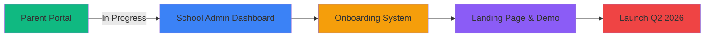

<div align="center">

# 👋 Hey, I'm Jason

### Founder & Full Stack Developer | Building the Future of EdTech in Ghana

<p align="center">
  <a href="https://linkedin.com/in/yourprofile"></a>
  <a href="mailto:your.email@example.com"></a>
  <a href="https://edureportgh.com"></a>
</p>

```ascii
╔══════════════════════════════════════════════════════════════╗
║  🚀 Transforming Education Through Technology                ║
║  💡 Building Solutions That Scale                            ║
║  🌍 Making an Impact in Ghana & Beyond                       ║
╚══════════════════════════════════════════════════════════════╝
```

</div>

---

## 🎯 About Me

I'm a **full-stack developer** and **founder** on a mission to modernize academic reporting in Ghana. Currently building **EduReportGh** from the ground up—a comprehensive platform that's transforming how schools communicate student progress to parents.

```typescript
const jason = {
    role: "Founder & Lead Developer",
    company: "EduReportGh",
    location: "Accra, Ghana 🇬🇭",
    focus: ["SaaS Development", "EdTech Innovation", "Building in Public"],
    currentGoal: "Scaling EduReportGh to 100+ schools by 2026",
    philosophy: "Ship fast. Iterate faster. Build what matters."
};
```

---

## 🏗️ Featured Project: EduReportGh

<div align="center">

### **The Digital Academic Reporting Platform for Modern Schools**

</div>

EduReportGh is a complete SaaS platform designed to replace traditional paper-based report cards with a secure, digital-first solution.

### 🔥 What I'm Building:

<table>
<tr>
<td width="50%">

**🎓 For Schools**
- 📊 Admin Dashboard with Analytics
- 👨‍🏫 Teacher Report Generation
- 📈 Performance Tracking
- 🔐 Secure Data Management
- 📱 Mobile-First Design

</td>
<td width="50%">

**👨‍👩‍👧 For Parents**
- 🔒 Secure Parent Portal
- 📲 Real-Time Notifications
- 📉 Progress Visualization
- 💬 Direct School Communication
- 📄 Digital Report Access

</td>
</tr>
</table>

### 🎨 Current Development Focus:



---

## 💻 Tech Arsenal

<div align="center">

### **Frontend Mastery**


### **Backend & Infrastructure**


### **DevOps & Deployment**


</div>

---

## 📊 GitHub Analytics

<div align="center">


</div>

<div align="center">

[](https://git.io/streak-stats)

</div>

---

## 🎯 What Drives Me

<div align="center">

| 🏗️ **Build** | 🚀 **Ship** | 📈 **Scale** | 💡 **Impact** |
|:---:|:---:|:---:|:---:|
| Production-Ready Systems | Fast Iteration Cycles | Scalable Architecture | Real-World Solutions |
| Clean, Maintainable Code | User-Centric Design | Performance Optimization | Educational Innovation |

</div>

### Core Expertise:

```javascript
const expertise = {
    saas: {
        authentication: "Multi-role auth systems",
        security: "Data encryption & access control",
        architecture: "Scalable Firebase infrastructure"
    },
    frontend: {
        frameworks: ["React", "Vite"],
        styling: "Tailwind CSS utility-first approach",
        ux: "Mobile-first responsive design"
    },
    deployment: {
        platforms: ["Netlify", "Firebase Hosting"],
        ci_cd: "Automated deployment pipelines",
        monitoring: "Performance analytics"
    }
};
```

---

## 🌟 My Journey

```
2024 ─────────────► 2025 ─────────────► 2026
  │                   │                   │
  │                   │                   ├─► Scale to 100+ Schools
  │                   │                   ├─► Full Platform Launch
  │                   │                   └─► Expand to Other African Countries
  │                   │
  │                   ├─► Beta Launch with 10 Schools
  │                   ├─► Complete Parent Portal
  │                   └─► Build Admin Dashboard
  │
  ├─► Founded EduReportGh
  ├─► Identified Market Gap
  └─► Started Development
```

---

## 💬 Let's Build Together

I'm always open to:

- 🤝 **Collaborations** on EdTech or SaaS projects
- 💡 **Discussions** about scaling startups in Africa
- 🚀 **Opportunities** to work on impactful products
- 📚 **Knowledge Sharing** about full-stack development

<div align="center">

### 📫 Reach Out

**Building something interesting? Let's talk.**

<a href="mailto:your.email@example.com">
  
</a>
<a href="https://linkedin.com/in/yourprofile">
  
</a>
<a href="https://twitter.com/yourhandle">
  
</a>

---


**"The best time to build was yesterday. The second best time is now."** 🚀

⭐️ From [jasonOBGh](https://github.com/jasonOBGh)

</div>
